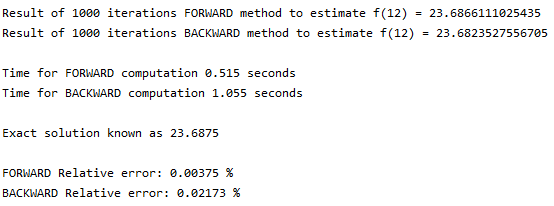
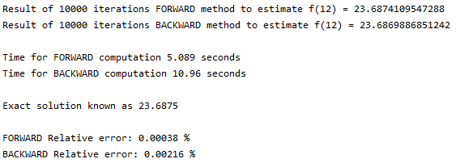

# computepac
A Python package of mathematical functions, iterative solvers, numerical analysis, and more.

## bisection
The Bisection method is an iterative numerical analysis scheme to find the roots of an equation.

To find the root of your equation between a certain lower and upper bound, run:

```python
import sympy as sym

f = sym.Function('f')
x = sym.Symbol('x')
f = '''YOUR EQUATION'''

bisection(f, lower bound, upper bound, accuracy desired)
```

Note that the bisection method presented here cannot calculate a root  of 0.  It specifically looks for
back-to-back iterations that result in < 0 and then > 0 or vice-versa.  So a function like `x**2` cannot be
estimated because it does not pass over the x-axis as the function goes from -1 to 1.

The Newton-Raphson method, however, can do this (see below).

The output format includes number of iterations to achieve desired accuracy, the root as calculated,
and the total time the program needed for computation.

```python
[num_itr, root, total_time]
```

Note that `sympy.plot(f)` can be used to plot any of your inputted functions to verify or explore roots.


## newton_raphson
The Newton-Raphson Method (or just Newton's Method) is an iterative scheme using derivatives to find
the root of a function.  To find the root of your equation, make a guess as to where it is, and run:

```python
import sympy as sym

f = sym.Function('f')
x = sym.Symbol('x')
f = '''YOUR EQUATION'''

newton_raphson(f, guess of root, accuracy desired)
```

The output format includes number of iterations to achieve desired accuracy, the root as calculated,
and the total time the program needed for computation.

```python
[num_itr, root, total_time]
```


## runge_kutta_two; runge_kutta_four
Runge Kutta is an iterative scheme that approximates numerical solutions to ordinary differential equations.  To 
approximate an ODE between two boundaries, if you know the initial conditions (`x0` and `y0`), you can run either
`rktwo` or `rkfour`.  Runge-Kutta second order should produce less accurate results than Runge-Kutta fourth order:

```python
import sympy as sym

f = sym.Function('f')
x1 = sym.Symbol('x1')
x2 = sym.Symbol('x2')
f = '''YOUR EQUATION with x1, x2 as x, y'''

rktwo(f, x0, y0, lower bound, upper bound, num steps)
rkfour(f, x0, y0, lower bound, upper bound, num steps)
```

It is important here that you use `f(x1,x2)` over `f(x,y)` in the SymPy function so that the program runs properly.
The output format includes a (n-large) list of numerical approximations between the bounds given, and the computational
time.

```python
[[y_values], total_time]
```


## euler_forward, backward
Euler's method uses the derivative of an equation and an initial condition to estimate it at a future point.  It is 
useful for estimating ODEs.  To estimate an ODE at a certain point, as long as you have an initial condition,
run:

```python
import sympy as sym

f = sym.Function('f')
x1 = sym.Symbol('x1')
x2 = sym.Symbol('x2')
f = '''dy/dx equation with x1, x2 as x, y'''

euler_[ ](f, x0, y0, lower bound, upper bound, num steps)
```

Again, use `f(x1,x2)` instead of `f(x,y)` in the SymPy function so that the program runs properly.
The output format is a (n-large) list of numerical approximations between the bounds given, and the computational
time.

```python
[[y_values], total_time]
```

The value added in using `euler_backward` over `euler_foward` is that the scheme is stable even with a step-size 
that's too small.  For example, running the forwards euler scheme with a very limited number of steps will result in 
sawtoothing / instability.


## Examples
### Convergence Test
I built a simple convergence test to see if the Bisection and Newton methods would converge to the same root given
the same equation.  The function I chose was `6x^3 + 4x^2 + x + 1`.  The bounds were set as `[-10,10]` for Bisection and a guess of `0` for Newton's method.  The 
results are given below.


### Euler Example
I tested this module with the ODE `dy/dx = 6 - 2*(y/x)`, with `y(3) = 1`, attempting to use
`euler_forward` to estimate `y(12)`.  The exact solution is known as `23.6875`.

The forward program returned the following:

##### 1,000 iterations:



##### 10,000 iterations:




 ## How to run tests
This package uses `pytest` for unit testing.

To run tests locally in a terminal, run the following three lines:

```bash
cd your_path/computepac
chmod +x test.sh
./test.sh
```

Or, you can load the `computepac` package in PyCharm and simply type into the local terminal:

```bash
pytest
```

All unit tests are located in the `tests` directory.  One sample test was built for debugging purposes
(`test_sample.py`).  This unit test will always pass.  If it does not run, then something is wrong with
pytest or your local setup (make sure you are in the right directory).  The `tests` directory is set up 
to import all functions from `computepac` using an `__init__` file.


## TODO / Future Additions

Some additional modules that I want to generalize and bring to this repository:
- FTCS
- Finite Difference schemes
- possibly some application examples in transport or diffusion equations
